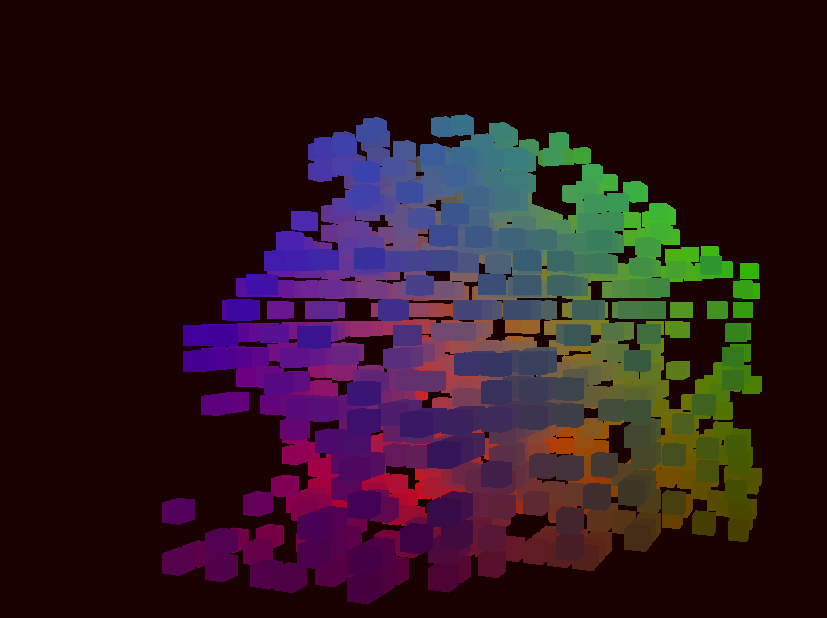

# 3D Cellular Automata

This is a project that ressembles the classic Game of Life, but implemented in a 3D world. The
project needs OpenGL 4.5 or greater to render, and currently only compiles under Linux (although
it would be relatively easy to change CMakeLists to compile for Windows/macOS*(apple discontinued
OpenGL support in favor of Metal)).



## Installation

```bash
    git clone https:github.com/noctrog/3d-cellular-automata
    cd 3d-cellular-automata/build
    cmake ..
    make -j
    make install -- would not recommend since this project is a WIP
```

## Run 

If you just compiled, from the build folder, run:

```bash
    ../bin/3D_Cellular_Automata -f ../map.txt
```

The -f argument tells the program from which text file to load the initial map conditions. A map
file must look like this:

```txt
    rule: 2 3 3 3
    size: 10
    cells:
    0 2 3
    3 5 1
    5 3 1
```

* Rule:
    * First number: min of neighbour cells to survive.
    * Second number: max of neighbour cells to survive.
    * Third number: min of neighbours for a cell to be born.
    * Fourth number: max of neighbours for a cell to be born.
* Size: the size of the cubic world.
* Cells: tells the program where to insert the initial cells, each cells needs a new line,
    specifying x, y and z coordinates as unsigned integers (from 0 to size-1)

### Controls

* A-D: orbit
* W-S: zoom
* Spacebar: run 1 epoch
* Esc: exit

